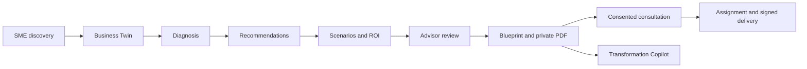
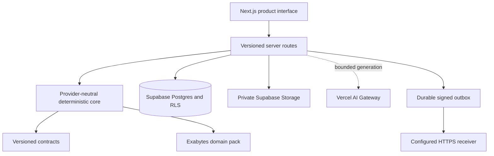

# MajuPilot

MajuPilot is an evidence-backed Digital and AI Transformation advisor for Malaysian SMEs and the Exabytes advisory workflow. It turns a structured discovery interview into an inspectable Business Twin, deterministic diagnosis, capability-first recommendations, transformation scenarios, an advisor-reviewed Blueprint, a canonical private PDF, and a consented consultation handoff.

Production: <https://majupilot-exabytes.vercel.app/>

## Product journey



## What is implemented

- Five-step SME discovery with bounded, evidence-linked follow-up questions.
- Editable Business Twin with confidence and source provenance.
- Deterministic digital-maturity, AI-readiness, pain ranking, scenario, cost, value, and payback engines.
- Capability-first recommendations mapped to a versioned Exabytes catalogue.
- Live DeepSeek interpretation through Vercel AI Gateway, with strict schemas, budgets, safe telemetry, and deterministic fallbacks where permitted.
- Five evidence-bounded advisor perspectives and a 16-section Transformation Blueprint.
- Deterministic canonical PDF generation, private Supabase Storage, content hashes, and short-lived signed downloads.
- Immutable accepted consultant notes derived from reviewed drafts.
- Durable Supabase persistence, guest ownership, organization roles, tenant isolation, RLS, consent records, leads, deterministic assignment, audit events, and export/deletion request contracts.
- A persisted Transformation Copilot with typed reads and confirmation-gated, idempotent writes.
- An assessment-scoped private Evidence Library for bounded PDF, DOCX, and TXT uploads, with cited Copilot retrieval.
- A durable signed-webhook outbox with leasing, bounded retry, dead-letter handling, replay authorization, SSRF protection, and redacted delivery receipts.
- Responsive, keyboard-accessible interfaces plus three clearly labelled fictional demonstration cases.

Copilot answers from the persisted structured Business Twin, diagnosis, recommendations, scenarios, Blueprint, report, lead, and audit records. Uploaded documents add a separate, bounded and cited evidence source; unsupported or unanswerable document questions fail closed.

## Architecture



Models do not own scores, ranks, budgets, prerequisites, catalogue facts, ROI arithmetic, or persistence decisions. Those remain deterministic and versioned. Contact details are never sent to the model.

## Repository layout and the original project

This repository contains the complete inherited application, not a thin overlay. The accepted original project history is preserved in Git at tag `v1.0.0-baseline`, and the original remote is retained as the read-only `v1` remote. The application directory is still named `sme-growth-twin/` because renaming the internal root would add deployment and history risk without changing the product; all customer-facing surfaces are branded MajuPilot.

Managed Codex worktrees were temporary isolated checkouts used to implement and review phases safely. Their accepted commits were merged into this repository's `main` branch, so the authoritative current files are here. Large local sizes usually come from generated or ignored directories such as `node_modules/`, `.next/`, browser profiles, and evidence artifacts; Git stores source and required assets, not every generated dependency/cache copy.

```text
planning/                       # contracts, source records, stage ledger, release evidence
sme-growth-twin/               # canonical Next.js application root
├── docs/                      # architecture and operational notes
├── scripts/                   # focused verification and release-smoke tools
├── supabase/                  # migrations, local config, and pgTAP security tests
├── src/
│   ├── app/                   # product pages and server routes
│   ├── components/            # UI by product workflow
│   ├── core/                  # deterministic engines and services
│   ├── domain/                # schemas and contracts
│   ├── domain-packs/exabytes/ # versioned catalogue and provider policy
│   └── infrastructure/        # Supabase, AI, reports, outbox, persistence
└── tests/                     # unit, integration, security, and release evidence
```

## Run locally

Prerequisites: Node.js 22.12 or newer, npm, and the configured `sme-growth-twin/.env.local` file.

```powershell
git clone https://github.com/desanv01/majupilot-exabytes.git
cd majupilot-exabytes\sme-growth-twin
npm ci
npm run dev
```

Open <http://localhost:3000>. Stop the server with `Ctrl+C`. On later runs, open a terminal in `sme-growth-twin/` and run only `npm run dev`; reinstall only when `package-lock.json` changes or `node_modules/` is absent.

Never commit `.env.local`. Only `NEXT_PUBLIC_SUPABASE_URL` and `NEXT_PUBLIC_SUPABASE_PUBLISHABLE_KEY` may be browser-visible; all service, Gateway, webhook, and cron credentials are server-only.

## Focused quality commands

Run from `sme-growth-twin/`:

| Command | Purpose |
|---|---|
| `npm run lint` | ESLint checks |
| `npm run type-check` | Strict TypeScript checks |
| `npm test` | Deterministic unit and integration suite |
| `npm run build` | Production Next.js build |
| `npm run test:stage07:golden` | Exact fictional A/B/C outcomes |
| `npm run test:stage07:security` | Server/client and secret-boundary checks |
| `npm run audit:production` | High/critical production dependency gate |

## Delivery record

V2 phases A through I are accepted and merged. The authoritative implementation evidence, exact PRs, corrections, live-AI proof, security assertions, and phase acceptance notes are recorded in [the stage ledger](planning/MAJUPILOT-V2-STAGE-LEDGER.md). The original baseline remains reachable at tag `v1.0.0-baseline`.

## Security

- Secrets and real customer records must never be committed, logged, or used in demos.
- Product and benchmark claims require traceable sources.
- Consent is explicit and immutable; private report access is owner/role scoped.
- Versioned routes use strict input schemas, bounded bodies, no-store responses, and owner/role checks.
- Webhook delivery is HTTPS-only, HMAC-signed, DNS/IP constrained, retry-bounded, and receipt-redacted.

See [SECURITY.md](SECURITY.md) for the supported status, disclosure route, controls, and operational limits.

## Contributing and license

Read [CONTRIBUTING.md](CONTRIBUTING.md) before changing contracts or deterministic rules. MajuPilot is licensed under the [MIT License](LICENSE); third-party names and trademarks remain the property of their respective owners.
