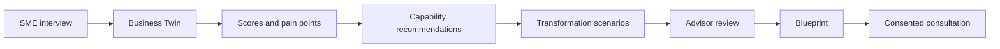
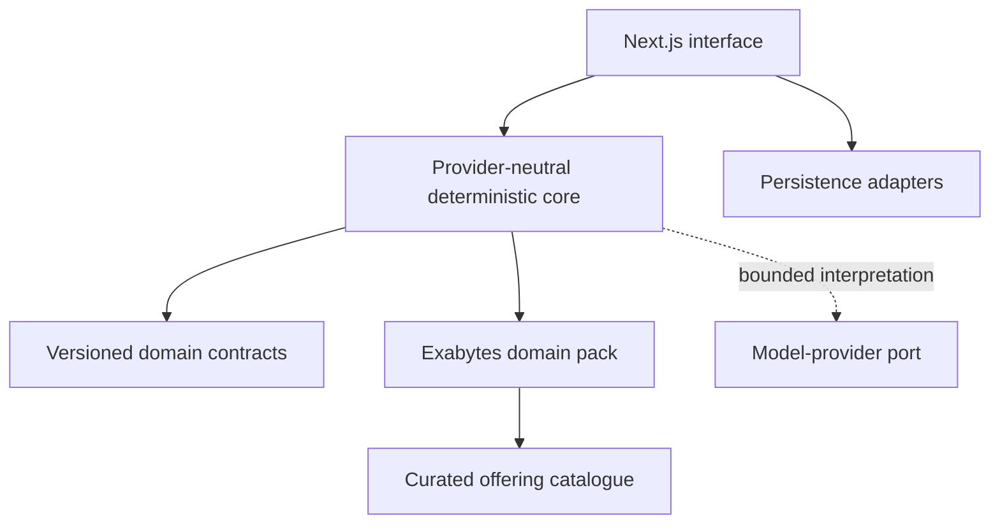

# SME Growth Twin

SME Growth Twin turns a short business interview into an explainable digital-maturity diagnosis, evidence-linked capability recommendations, and a practical transformation blueprint for Malaysian SMEs.

> Project status: active AI Horizon Solution Challenge 2026 build. Stages 00–07 are accepted. The reviewed release candidate is live at <https://sme-growth-twin.vercel.app>; human rehearsal, video/YouTube, competition submission, and receipt gates remain pending.

## Why this exists

SME owners often know they need to digitalise but lack a defensible answer to four connected questions: what should change first, why it matters, what it could cost, and what outcome is realistically possible. Generic chat responses cannot reliably preserve evidence, reproduce scores, enforce prerequisites, or show how a recommendation was reached.

SME Growth Twin converts structured interview evidence into an inspectable business twin and uses deterministic engines for scoring, pain ranking, capability sequencing, catalogue mapping, scenarios, and ROI. AI is reserved for bounded interpretation and advisor perspectives; it does not own arithmetic or product facts.

## Current capabilities

- Five-step SME discovery interview with bounded conditional follow-ups.
- Editable Business Twin review with evidence and confidence handling.
- Deterministic digital-maturity and AI-readiness scores.
- Evidence-linked pain-point ranking and expandable calculation details.
- Capability-first recommendations with prerequisites and timing.
- Versioned mapping to a curated Exabytes offering catalogue.
- Three deterministic transformation scenarios with inspectable costs, value ranges, assumptions, exclusions, and payback.
- Five evidence-bounded advisor perspectives with per-role deterministic fallback and optional server-only model review.
- An immutable, source-linked 16-section Transformation Blueprint with responsive browser print/save-as-PDF output.
- A consented consultation handoff with exact Blueprint verification, idempotent submission, and a privacy-minimizing safe receipt.
- Stable local persistence and recalculation when upstream evidence changes.
- Responsive, keyboard-accessible interfaces validated at desktop and 360 px.
- Offline-friendly deterministic demonstration path.
- Three schema-validated fictional golden cases with scoped load/reset and persistent disclosure.
- Production security headers, advisor call budgets, hashed-IP process-local rate limits, and hermetic Stage 07 release evidence.

## Product flow



## Architecture



The provider-neutral core cannot import or mention Exabytes-specific identifiers. Product-selection policy belongs to the Exabytes domain pack and is protected by architecture tests.

## Technology

| Layer | Technology |
|---|---|
| Application | Next.js 16 App Router, React 19, TypeScript 6 |
| Validation | Zod 4 |
| Testing | Vitest 5 |
| Quality | ESLint 9, TypeScript strict checks, GitHub Actions |
| Current persistence | Versioned browser-local records plus a process-local prototype lead adapter behind storage ports |
| Design workflow | 12ui-generated directions, reviewed and corrected against product contracts |

## Quick start

Prerequisites: Node.js 22.12 or newer and npm.

```bash
git clone https://github.com/desanv01/sme-growth-twin.git
cd sme-growth-twin/sme-growth-twin
npm ci
npm run dev
```

Open <http://localhost:3000>.

## Quality commands

Run these from `sme-growth-twin/`:

| Command | Purpose |
|---|---|
| `npm run lint` | Check source and test lint rules |
| `npm run type-check` | Run TypeScript without emitting files |
| `npm test` | Run deterministic unit and integration tests |
| `npm run build` | Produce the release build |
| `npm run test:stage05:browser` | Verify the complete Stage 05 journey, exact figures, persistence, responsive layout, and print rendering |
| `npm run test:stage06:browser` | Verify the Blueprint-to-consultation journey, consent and replay safety, privacy boundary, responsive layout, focus order, and print exclusion |
| `npm run test:stage07:golden` | Freeze exact A/B/C outputs, fallback origins, and Blueprint completeness |
| `npm run test:stage07:browser` | Run the production axe, keyboard, responsive, duration, header, reset, and A/B/C fallback gate |
| `npm run test:stage07:security` | Verify advisor budgets/rate limits, scoped reset, secret scan, and server/client boundary |
| `npm run audit:production` | Fail on high/critical production dependency findings |
| `npm run release:manifest` | Emit a checksummed manifest outside the worktree by default |

Every pull request runs the static, unit, Stage 07 golden/security, production-audit, and build gates in GitHub Actions. Windows browser journeys remain explicit local release gates.

## Repository map

```text
planning/                       # authoritative product, stage, design, and decision records
├── MASTER-GAMEPLAN.md
├── STAGE-LEDGER.md
├── MIROFISH-REFERENCE-MAP.md
├── catalogue/
├── design/
└── stages/
sme-growth-twin/               # canonical application root
├── artifacts/                 # accepted local visual-regression evidence
├── docs/                      # implementation and architecture notes
├── scripts/                   # deterministic browser checks
├── src/
│   ├── app/                   # routes and application shell
│   ├── components/            # UI components by workflow stage
│   ├── core/                  # provider-neutral business engines
│   ├── domain/                # shared schemas and versioned contracts
│   ├── domain-packs/exabytes/ # catalogue and provider-specific policy
│   └── infrastructure/        # persistence and model-provider adapters
└── tests/
```

## Development record

The project uses a gated, stage-by-stage workflow. Each stage receives a frozen contract, a dedicated implementation branch, independent review, correction cycles where required, full validation, and an acceptance entry in the [stage ledger](planning/STAGE-LEDGER.md).

Stages 00–03 were completed before this repository was initialised. Their first GitHub checkpoints are therefore explicitly recorded as reconstructed snapshots created on 17 September 2026, not as backdated development events. Stage 04 onward uses live branches, pull requests, CI, reviews, and merges.

## Roadmap

- [x] Stage 00 — Foundation and provider-neutral contracts
- [x] Stage 01 — Discovery and Business Twin
- [x] Stage 02 — Deterministic diagnostics and pain analysis
- [x] Stage 03 — Capability recommendations and Exabytes catalogue
- [x] Stage 04 — Scenario and ROI Lab
- [x] Stage 05 — Advisor Panel and Blueprint
- [x] Stage 06 — Consultation handoff and full journey
- [x] Stage 07 — Hardening, evidence, and submission

## Security and data handling

- Secrets belong in local environment files and must never be committed.
- Scoring, ranking, recommendation, scenario, and ROI arithmetic remain deterministic.
- Product facts come from a reviewed, versioned catalogue rather than model memory.
- Missing evidence lowers confidence; it is not silently converted to a negative answer.
- Consultation data is created only after explicit user consent; contact values are not logged, returned by the API, placed in URLs, or persisted in the browser.

See [SECURITY.md](SECURITY.md) for reporting and prototype limitations.

The self-contained demo, deployment, evidence, third-party, and manual-gate package is in [`planning/submission/`](planning/submission/README.md). A reviewed Vercel deployment is recorded there; no video upload, competition submission, human study, or official receipt is claimed without real evidence.

## Reference and originality

MiroFish is an important functional and architectural research reference for staged evidence ingestion, structured world models, scenario execution, and investigable reporting. SME Growth Twin is a ground-up implementation with its own domain model, terminology, interfaces, rules, tests, and code. The project records every MiroFish-inspired decision as retain, adapt, replace, or omit in the [reference map](planning/MIROFISH-REFERENCE-MAP.md).

Exabytes product information is maintained as a separately versioned catalogue with source provenance. Third-party frameworks, models, design tooling, and dependencies are declared rather than presented as original work.

## Contributing

Read [CONTRIBUTING.md](CONTRIBUTING.md) before changing contracts or core calculation rules. Pull requests should be focused, explain user impact, and include validation appropriate to the risk.

## License

Licensed under the [MIT License](LICENSE). Third-party names and trademarks remain the property of their respective owners.
