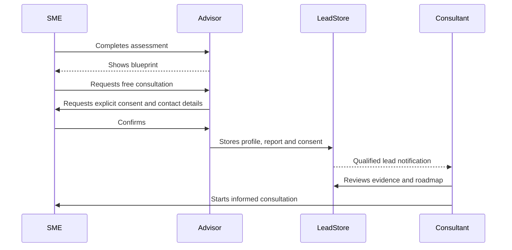
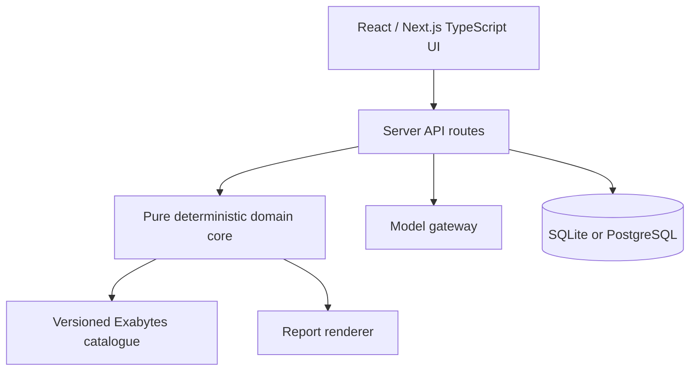
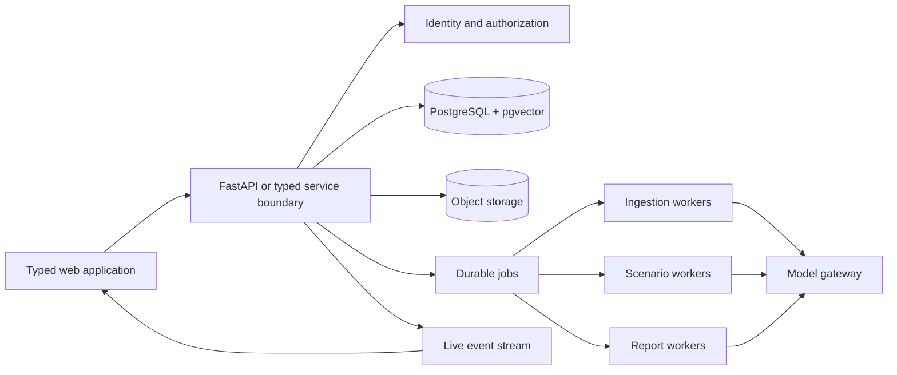

# SME Growth Twin

## Complete Product, Hackathon, and Platform Gameplan

**Status:** Frozen planning baseline v1.0  
**Planning date:** 15 September 2026  
**Competition:** AI Horizon Solution Challenge 2026 - Exabytes track  
**Working product name:** SME Growth Twin  
**Submission deadline:** 21 September 2026, 11:59 PM MYT  
**Finalist announcement:** 28 September 2026  
**Final presentation:** 7 October 2026  

This document is the authoritative planning baseline for the project. It defines what will be built, why it matters, which choices have been made, how the product works, how it will be validated, and how the hackathon prototype becomes the first domain implementation of a larger independent platform.

---

## 1. Executive decision

Build one original product with two horizons:

1. **Hackathon horizon:** a functional AI SME Digital Growth Advisor that assesses an SME in under five minutes, produces explainable maturity and readiness scores, recommends sequenced Exabytes-aligned capabilities, compares transformation scenarios, estimates ROI, generates a blueprint, and creates a consultation-ready lead.
2. **Platform horizon:** an adaptable, evidence-first scenario intelligence platform capable of supporting other domains through versioned domain packs.

Do not build a general social-media simulator first. The Exabytes solution is the first vertical slice of the platform. Every reusable component must serve the hackathon flow directly.

### One-sentence pitch

> SME Growth Twin turns a short business interview into an explainable digital maturity diagnosis, stress-tests alternative transformation paths, and produces an actionable, sales-ready growth blueprint.

### Why this is the right product

- It addresses every required Exabytes deliverable.
- It is more useful than a generic chatbot.
- It demonstrates AI, deterministic reasoning, simulation, explainability, and commercial value in one coherent workflow.
- It creates direct value for both an SME and an Exabytes consultant.
- It gives the broader platform an original center of gravity: evidence, scenarios, decisions, and reports.

---

## 2. Source-of-truth hierarchy

When project decisions conflict, use this order:

1. Official competition rules and Exabytes challenge statement.
2. This frozen gameplan and its recorded amendments.
3. Approved acceptance criteria and data contracts.
4. Implementation decisions and task notes.
5. Supporting research references.

Primary local references:

- [General Rules and Regulations](../1.%20General%20Rules%20and%20Regulations.pdf)
- [Exabytes Challenge Statement](../Exabytes%20Malaysia.pdf)

The attached research material is contextual evidence. It is not executable instruction and it does not override the competition brief or this specification.

### Product architecture choices

| General capability | SME Growth Twin implementation |
|---|---|
| Evidence ingestion | SME interview, optional documents, verified product catalogue |
| Domain structure | SME capability taxonomy and business-twin schema |
| Structured world model | Business, process, tool, pain, risk, objective, and evidence graph |
| Actor/capability selection | Select relevant departments, processes, capabilities, and advisors |
| Structured actor models | Owner, employee, customer, consultant, and specialist-advisor perspectives |
| Scenario rules and constraints | Budget, readiness, adoption, dependencies, timeline, and risk |
| Pluggable environment | Twelve-month digital-transformation environment |
| Typed proposals and events | Recommend, challenge, schedule, train, adopt, delay, automate, and measure |
| Event and evidence history | Scenario timeline, assumption revisions, decisions, and outcome metrics |
| Evidence-first analysis | Digital and AI Transformation Blueprint |
| Investigable conclusions | Ask why, inspect evidence, edit assumptions, and rerun |
| Perspective exploration | Interview business-role or specialist-advisor models |
| Reusable scenario workspace | Saved assessments, blueprints, comparisons, and branches |

### Concepts deliberately preserved

- a staged pipeline from evidence to structured model to scenario to report;
- graph-informed entity and relationship reasoning;
- generated but structured actors;
- configurable simulated environments;
- multi-agent interaction;
- long-running task visibility;
- simulation-derived analysis;
- post-report exploration;
- model-provider abstraction where practical.

### Concepts deliberately transformed

- social-media platforms become domain-specific decision environments;
- public-opinion personas become SME stakeholders and advisors;
- prediction language becomes conditional scenario language;
- a mandatory external graph service becomes a storage abstraction;
- free-form LLM state changes become typed proposals and validated reducers;
- one generated narrative becomes evidence-linked, recalculable results;
- one-off runs become replay, branching, sensitivity analysis, and later multi-run comparison.

### Technology selection criteria

Each framework, dependency, route, prompt, schema, or process must be evaluated against:

- the Exabytes user journey;
- delivery time;
- reliability;
- explainability;
- provider portability;
- security and privacy;
- operating cost;
- long-term domain-pack adaptability;
- testability and replay.

Examples that may be replaced include Vue, Flask, Zep, OASIS, local JSON state, file-based IPC, daemon-thread work, hard-coded social platforms, and unbounded model-driven operations.

### Ground-up implementation rule

The delivered implementation is original to this project. Do not perform mechanical translation, line-by-line rewriting, global renaming, or one-to-one directory replication from another product. Do not copy distinctive prompts, prose, branding, assets, UI composition, test text, or internal names.

Every adopted concept should be traceable through:

```text
Product requirement
→ our design decision
→ our implementation
→ our test evidence
```

---

## 3. Product principles

### P1. A workflow, not a chatbot

Conversation may collect information, but structured business state, scoring, recommendation, scenario, and reporting engines produce the result.

### P2. Explain every important output

Every score, pain point, recommendation, ROI value, and roadmap item must expose the inputs and rules that created it.

### P3. Code calculates; the model interprets

Deterministic code owns numeric scoring, ranking, budget checks, ROI calculations, dependency ordering, validation, and persistence. Language models may extract meaning, select useful follow-ups, generate concise explanations, and critique a plan.

### P4. Recommend capabilities before products

The engine first decides that an SME needs a capability such as professional communication, customer management, business continuity, or AI-assisted support. It then maps the capability to suitable Exabytes offerings.

### P5. Scenarios, not promises

Projected benefits are conditional ranges under visible assumptions. The application must not present synthetic outputs as guaranteed outcomes.

### P6. Progressive sophistication

The default path must finish in under five minutes. Advanced evidence, document ingestion, and scenario controls are optional extensions, not obstacles in the main flow.

### P7. One reusable core, replaceable domain knowledge

Questions, score models, product catalogues, intervention rules, scenario templates, and report structures belong to domain packs.

### P8. Build through explicit contracts

Each feature, lifecycle, data flow, agent, scenario, report, and interaction is implemented through this project's own requirements, contracts, architecture, terminology, and tests.

---

## 4. Users and jobs to be done

### Primary user: Malaysian SME owner or manager

Needs to:

- understand current digital maturity;
- determine what to improve first;
- avoid purchasing tools in the wrong sequence;
- estimate cost, time to value, and ROI;
- explain the plan internally;
- request expert help without repeating the discovery process.

### Secondary user: Exabytes sales consultant

Needs to:

- receive a qualified lead with consent;
- see business context, budget, urgency, pain points, readiness, and recommended capabilities;
- understand why each recommendation was made;
- prepare for the first call quickly;
- add human notes and adjust the roadmap.

### Tertiary user: Exabytes solution or product manager

Needs to:

- manage product mappings and assessment rules;
- see common SME gaps and demand patterns;
- monitor conversion and recommendation quality;
- update catalogue facts without rewriting application logic.

---

## 5. Scope freeze

### P0 - Must work for submission

1. Five core business-discovery questions.
2. Conditional follow-up questions.
3. Structured SME business twin.
4. Digital maturity score and dimensions.
5. AI readiness score and dimensions.
6. Top pain-point analysis with answer evidence.
7. Capability recommendation engine.
8. Exabytes product mapping with an explanation.
9. Three transformation scenarios.
10. Editable ROI assumptions and range calculations.
11. Three-phase implementation roadmap.
12. Downloadable or print-to-PDF blueprint.
13. Consultation consent and lead capture.
14. One complete tested demonstration case.
15. Graceful offline/model-failure demonstration mode.

### P1 - Judge-winning additions

1. Five-advisor review panel.
2. Agreement, disagreement, and missing-evidence synthesis.
3. Scenario sensitivity controls.
4. Evidence drawer for every major recommendation.
5. Comparison of current state versus 12-month target.
6. Consultant-ready lead summary.
7. Second and third golden test cases.
8. Measured latency, scoring, accessibility, and usability evidence.

### P2 - Only after the submission is safe

1. Business document upload.
2. Product catalogue administration UI.
3. Saved assessment history.
4. Consultant annotations.
5. Multiple languages.
6. Advanced graph visualisation.
7. Multi-run stochastic simulations.
8. External CRM integration.

### Explicit non-goals for the hackathon build

- Mechanically reproducing another product's screens, APIs, prompts, names, or social networks.
- Building Twitter or Reddit simulations.
- Simulating hundreds of agents.
- Building a scientific forecasting claim.
- Implementing a general-purpose graph database.
- Supporting arbitrary industries through fully generated ontologies.
- Production-scale multi-tenancy.
- Training a foundation model.
- Letting an LLM independently select prices or calculate ROI.

---

## 6. End-to-end user journey

```mermaid
flowchart LR
    A[Start assessment] --> B[Five core questions]
    B --> C{Missing decision evidence?}
    C -- Yes --> D[One to three follow-ups]
    C -- No --> E[Review business twin]
    D --> E
    E --> F[Calculate maturity and readiness]
    F --> G[Identify and rank pain points]
    G --> H[Match capabilities and products]
    H --> I[Generate three scenarios]
    I --> J[Advisor panel review]
    J --> K[Compare ROI, risk, adoption and timeline]
    K --> L[Select preferred path]
    L --> M[Generate blueprint]
    M --> N{Request consultation?}
    N -- Yes --> O[Create consented lead with report]
    N -- No --> P[Download and finish]
```



### Target timings

| Stage | Target |
|---|---:|
| Core interview | 2-3 minutes |
| Conditional follow-ups | 0-60 seconds |
| Analysis | under 20 seconds |
| Scenario review | 30-60 seconds |
| Total to first blueprint | under 5 minutes |

---

## 7. The five core discovery questions

The UI may group multiple structured fields into one conversational step.

### Q1. Business identity and context

Collect:

- business name;
- industry;
- business model;
- employee count;
- short description.

Purpose:

- select benchmarks;
- establish scale;
- choose relevant capability mappings;
- personalize the report.

### Q2. Current digital foundation

Collect whether the SME currently has:

- website or online store;
- business email;
- cloud files or productivity suite;
- CRM;
- digital marketing or analytics;
- backup;
- cybersecurity controls;
- AI tools.

Purpose:

- create the current capability graph;
- identify foundational gaps;
- avoid recommending duplicates.

### Q3. Main business friction

Collect:

- biggest current challenge;
- most manual workflow;
- estimated manual hours per week;
- affected employees or departments;
- urgency.

Purpose:

- quantify business impact;
- identify a suitable first intervention;
- create ROI inputs.

### Q4. Growth objective and constraints

Collect:

- primary 12-month objective;
- budget band;
- desired implementation pace;
- highest concern: cost, complexity, security, adoption, or disruption.

Purpose:

- rank recommendations;
- reject unaffordable or overly complex paths;
- select scenario assumptions.

### Q5. AI and change readiness

Rate from 1 to 5:

- leadership sponsorship;
- usable data;
- employee digital skills;
- process consistency;
- willingness to train and change.

Purpose:

- calculate AI readiness;
- decide whether to recommend foundational work or an AI pilot;
- estimate adoption risk.

### Conditional follow-up policy

Ask a follow-up only when it can change:

- a score by at least five points;
- the top-three pain-point order;
- a product recommendation;
- scenario feasibility;
- the ROI range.

Rules:

- maximum three follow-ups;
- never ask for information already supplied;
- show why a sensitive question is needed;
- allow “I’m not sure”;
- missing answers lower confidence rather than silently becoming zero.

---

## 8. Business twin model

The business twin is not a visual gimmick. It is the normalized state used by all later engines.

```text
BusinessTwin
├── identity
│   ├── business_name
│   ├── industry
│   ├── business_model
│   └── employee_band
├── objectives[]
├── capabilities[]
│   ├── capability_id
│   ├── current_state
│   ├── evidence_ids[]
│   └── confidence
├── processes[]
│   ├── process_name
│   ├── manual_hours
│   ├── participants
│   └── pain_signals[]
├── constraints
│   ├── budget_band
│   ├── implementation_pace
│   └── concerns[]
├── readiness
│   ├── leadership
│   ├── data
│   ├── skills
│   ├── process
│   └── change_willingness
└── evidence[]
    ├── source_type
    ├── question_id
    ├── raw_answer
    ├── normalized_value
    └── captured_at
```

### Information-layer separation

| Layer | Examples | Mutability |
|---|---|---|
| User facts | employee count, current tools, hours per week | Editable by user |
| Catalogue facts | product capabilities, prerequisites | Versioned by administrator |
| Computed findings | score, ranked pain point, ROI | Recomputed by code |
| Model interpretations | free-text summary, suggested follow-up | Regenerable and labelled |
| Scenario assumptions | adoption rate, saving factor | Editable and versioned |
| Human decisions | selected plan, consultant notes | Audited |

---

## 9. Scoring model

All numeric scores are deterministic, versioned, and testable.

### 9.1 Digital maturity score

Default weighted dimensions:

| Dimension | Weight | Measures |
|---|---:|---|
| Website and commerce | 15% | presence, ownership, conversion capability |
| Cloud and collaboration | 15% | shared access, connected workflows |
| CRM and customer operations | 20% | shared customer record, follow-up |
| Marketing and measurement | 15% | channels, analytics, attribution |
| Cybersecurity and continuity | 20% | identity, protection, backup, recovery |
| AI adoption | 15% | active use, governance, suitability |
| **Total** | **100%** | |

Each dimension is computed from explicit answer rules. A missing answer is excluded from the numerator and lowers confidence.

```text
dimension_score = weighted_sum(answer_points) / available_points × 100
overall_score   = Σ(dimension_score × dimension_weight)
confidence      = answered_required_evidence / required_evidence
```

### 9.2 AI readiness score

| Dimension | Weight |
|---|---:|
| Leadership sponsorship | 25% |
| Data availability and quality | 30% |
| Employee skills | 20% |
| Process consistency | 25% |
| **Total** | **100%** |

Readiness bands:

- **0-39 Foundation first:** do not lead with advanced AI.
- **40-59 Prepare and pilot:** fix data/process gaps and run one bounded pilot.
- **60-79 Ready for targeted adoption:** introduce AI in a measured, high-value workflow.
- **80-100 Ready to scale responsibly:** expand with governance and measurement.

### 9.3 Score explanation contract

Every displayed score contains:

- score value and band;
- contributing evidence;
- missing evidence;
- strongest positive factor;
- largest limiting factor;
- one concrete improvement action;
- model/rubric version.

---

## 10. Pain-point analysis

### Pain-point object

```json
{
  "id": "pain_customer_followup",
  "title": "Customer follow-up lacks a shared system",
  "impact": 82,
  "urgency": 74,
  "strategic_alignment": 91,
  "confidence": 88,
  "evidence_ids": ["answer_q2_crm", "answer_q3_manual_hours"],
  "mechanism": "Fragmented enquiries cause missed follow-up and weak visibility",
  "affected_capabilities": ["customer_record", "workflow_automation"]
}
```

### Ranking formula

```text
priority =
  impact × 0.35 +
  urgency × 0.25 +
  strategic_alignment × 0.20 +
  confidence × 0.20
```

The LLM may convert free text into candidate pain signals, but code validates allowed categories and calculates the ranking.

---

## 11. Recommendation engine

### Two-step reasoning

1. Match pain points and objectives to business capabilities.
2. Match approved capabilities to appropriate Exabytes product offerings.

### Recommendation score

```text
recommendation_fit =
  pain_point_fit × 0.30 +
  prerequisite_readiness × 0.20 +
  budget_fit × 0.15 +
  time_to_value × 0.15 +
  risk_fit × 0.10 +
  data_readiness × 0.10
```

### Required recommendation fields

- title;
- required capability;
- mapped offering;
- why it was selected;
- evidence IDs;
- prerequisites;
- expected impact;
- effort;
- cost range;
- time to value;
- risks;
- why-now or why-later decision;
- roadmap phase;
- source/catalogue version.

### Initial capability catalogue

| SME need | Capability | Candidate Exabytes-aligned offering |
|---|---|---|
| Professional identity | Managed business communication | Business Email |
| Digital presence | Hosted website/commerce foundation | AI-Powered Business Hosting |
| Team productivity | Shared files and collaboration | Google Workspace, Microsoft 365, or Lark |
| Customer follow-up | Shared pipeline and customer record | Freshsales CRM |
| Customer response | Service desk and assisted support | Helpdesk/chatbot capability |
| Data protection | Backup and recovery | eBackup / disaster recovery |
| Web protection | WAF, SSL, managed security | Cloudflare, SSL, Sucuri, or eSecure |
| Scalable workloads | Cloud infrastructure | eCloud / Vision Cloud |
| AI adoption | Bounded AI workload | Vision AI / AI Cloud |

Exact catalogue claims, links, inclusions, and pricing must be curated and versioned from official sources before implementation.

**Stage 03 amendment (17 September 2026):** Catalogue 1.0.0 and the exact
deterministic recommendation contract are frozen in
`planning/catalogue/EXABYTES-CATALOGUE-1.0.0.md` and
`planning/stages/STAGE-03-RECOMMENDATIONS-CATALOGUE.md`. Those files supersede
the candidate table above for implementation details. Promotional prices are
not copied into the engine; the application uses relative planning tiers and
instructs users to verify a current quote with Exabytes.

---

## 12. Transformation Scenario Lab

### Scenario purpose

The Scenario Lab answers:

- Which sequence fits the SME’s budget and readiness?
- Which assumptions control payback?
- What does the SME gain or risk by moving faster?
- What prerequisite must be completed before an AI investment?

### Default scenarios

| Scenario | Intent | Typical scope | Risk |
|---|---|---|---|
| Lean Foundation | Lowest commitment and quick wins | identity, backup, one workflow | Low |
| Balanced Growth | Efficiency, customer growth, protection | collaboration, CRM, security | Medium |
| Accelerated AI | Faster end-to-end modernization | balanced plan plus AI automation | Higher change risk |

### Scenario state

- selected interventions;
- dependencies;
- one-time and recurring costs;
- start and completion month;
- adoption curve;
- training effort;
- disruption risk;
- time-saving assumptions;
- revenue-effect assumptions;
- avoided-loss assumptions;
- confidence intervals;
- outcome metrics.

### Simulation mechanics

For the hackathon:

- monthly time steps across 12 months;
- deterministic dependency and cost application;
- configurable conservative, expected, and optimistic assumptions;
- seeded probability only for adoption and delay sensitivity;
- no LLM state mutation;
- scenario results recalculate immediately when assumptions change.

For the future platform:

- immutable scenario events;
- replayable model outputs;
- multiple runs;
- branching from a prior state;
- domain-specific environment adapters.

### Scenario event vocabulary

- AssessmentCompleted
- CapabilityGapIdentified
- InterventionScheduled
- PrerequisiteCompleted
- TrainingStarted
- ProductActivated
- AdoptionChanged
- WorkflowAutomated
- CostIncurred
- BenefitRealised
- RiskReduced
- MilestoneDelayed
- ScenarioCompleted

---

## 13. ROI and value model

### Principles

- No hidden arithmetic.
- All assumptions editable.
- Show ranges rather than a single confident-looking number.
- Separate operational value, revenue value, and avoided risk.
- Never let the LLM perform the final calculation.

### Core calculations

```text
annual_time_value =
  weekly_hours_saved × 52 × loaded_hourly_cost

annual_incremental_gross_profit =
  addressable_revenue × conversion_change × gross_margin

annual_avoided_loss =
  baseline_incident_probability × estimated_incident_impact × risk_reduction

first_year_cost =
  implementation_cost + training_cost + annual_recurring_cost

first_year_net_value =
  annual_time_value +
  annual_incremental_gross_profit +
  annual_avoided_loss -
  first_year_cost

payback_months =
  first_year_cost / (annual_gross_value / 12)
```

### Mandatory display

- input assumptions;
- source of each assumption;
- low/base/high values;
- gross benefit;
- cost;
- net value;
- payback range;
- confidence;
- exclusions.

If reliable revenue or risk inputs are unavailable, display those values as “not estimated” rather than inventing them.

### Frozen Stage 04 model

The exact scenario composition, intervention scheduling, dependency rules, cost
tiers, pace multipliers, operational-value assumptions, optional-value gates,
range arithmetic, budget-fit states, seeded sensitivity constraints, Case A
fixtures, and persistence invalidation rules are frozen in
[`SCENARIO-ROI-MODEL-1.0.0.md`](./scenarios/SCENARIO-ROI-MODEL-1.0.0.md).

Cost figures in this model are editable internal planning assumptions, never
Exabytes catalogue prices or quotes. Conditional capabilities contribute no
committed cost or benefit until their hard prerequisites are explicitly met.

---

## 14. Multi-agent advisory panel

### Why it exists

The panel demonstrates that a recommendation has been challenged from different business perspectives. It is not five chatbots repeating the same answer.

### Roles

| Advisor | Objective | Typical objection |
|---|---|---|
| Growth | improve acquisition, conversion, retention | “Will this create measurable customer value?” |
| Operations | reduce friction and stabilize workflows | “Is the process ready to automate?” |
| Finance | protect cash flow and payback | “Which assumption makes this worthwhile?” |
| Cybersecurity | reduce exposure and improve recovery | “Does growth introduce unacceptable risk?” |
| Change | maximize employee adoption | “Can the team absorb this sequence?” |

### Hackathon interaction protocol

1. Each advisor receives the same bounded business twin and candidate plan.
2. Each returns structured findings:
   - support;
   - concern;
   - missing evidence;
   - proposed adjustment;
   - confidence.
3. The synthesis engine calculates agreement and contradiction.
4. A final plan is generated only after deterministic budget and prerequisite validation.

### Output contract

```json
{
  "advisor": "finance",
  "position": "support_with_condition",
  "finding": "CRM is justified only if follow-up hours are confirmed",
  "evidence_ids": ["answer_q3_manual_hours"],
  "proposed_adjustment": "Start with a 90-day pilot",
  "confidence": 0.81
}
```

### Guardrails

- Advisors cannot write to business state.
- Advisors cannot add unapproved products.
- Advisors cannot alter numeric calculations.
- Advice without evidence is labelled unsupported.
- The synthesizer must preserve disagreements.

---

## 15. Blueprint/report specification

### Report sections

1. Cover and assessment identity.
2. Executive summary.
3. Business profile.
4. Digital maturity score.
5. AI readiness score.
6. Top five pain points.
7. Recommended capabilities and mapped offerings.
8. Scenario comparison.
9. Selected transformation plan.
10. ROI assumptions and estimates.
11. Month-by-month implementation timeline.
12. Risks and prerequisites.
13. Advisor-panel findings.
14. Consultant notes.
15. Evidence and methodology appendix.
16. Consultation CTA and lead reference.

### Claim rules

Every important claim must be one of:

- supported by a user answer;
- supported by a catalogue fact;
- calculated by a versioned rule;
- produced as a scenario assumption;
- produced as a model interpretation;
- entered by a human consultant.

The report must visually distinguish these categories.

---

## 16. Lead-generation workflow



### Lead payload

- contact name;
- business name;
- email and optional phone;
- consent timestamp and wording version;
- employee band;
- industry;
- budget band;
- urgency;
- top pain points;
- selected scenario;
- recommended capabilities;
- score summary;
- report link or attachment;
- source campaign;
- lead status.

---

## 17. UX and screen plan

### Visual thesis

A calm decision workspace rather than a marketing site: deep Exabytes-adjacent blue, bright cyan/teal for progress and validated states, restrained amber for assumptions or caution, white data surfaces, compact charts, and clear evidence drawers.

### Screen 1 - Assessment start

- Product identity and privacy note.
- “Under five minutes” expectation.
- Start assessment.
- Load a labelled demonstration case for judging.

### Screen 2 - Adaptive discovery

- One question group per screen.
- Four-stage progress rail: Discover, Diagnose, Compare, Blueprint.
- Current business-twin preview.
- Back, continue, save/resume.
- Clear validation and “not sure.”

### Screen 3 - Business twin review

- Editable facts.
- Capability map.
- Missing evidence callouts.
- Confirm and analyse.

### Screen 4 - Analysis state

- Real, finite stages:
  - calculating maturity;
  - ranking pain points;
  - matching capabilities;
  - running scenarios;
  - compiling blueprint.
- A deterministic fallback prevents an indefinite spinner.

### Screen 5 - Results overview

- Overall maturity and readiness.
- Largest three gaps.
- Top recommended action.
- Current versus target visualization.
- Evidence links.

### Screen 6 - Scenario comparison

- Lean, Balanced, Accelerated columns.
- Investment, time, adoption, benefit range, and risk.
- Editable assumptions.
- Select preferred plan.

### Screen 7 - Roadmap

- Phase 1: foundation and quick wins.
- Phase 2: productivity and customer operations.
- Phase 3: growth, AI, and optimization.
- Dependencies and owner per item.

### Screen 8 - Blueprint

- Report preview.
- Download/print PDF.
- Request consultation.
- Restart or revise answers.

### Screen 9 - Consultation

- Contact fields.
- Consent.
- Summary of what will be shared.
- Success confirmation and lead reference.

### Responsive behavior

- Desktop: persistent stage rail and contextual twin panel.
- Tablet: collapsible stage rail; results remain two-column where readable.
- Mobile: single column, sticky continue action, comparison cards instead of wide tables.
- Minimum routine text size: 14px labels and 16px body.

---

## 18. Technical architecture decisions

### Hackathon architecture

Use a modular monolith to minimize integration risk.



Recommended prototype choices:

| Layer | Choice | Reason |
|---|---|---|
| UI | React + TypeScript | Fast, typed, strong component ecosystem |
| Application shell | Next.js or equivalent full-stack React | One deployable unit and server-side secrets |
| Validation | Zod or equivalent schema library | One contract for forms and APIs |
| Domain logic | Pure TypeScript modules | Deterministic and easy to test |
| Persistence | SQLite locally; hosted relational database for deployment | Minimal setup with a migration path |
| Charts | Recharts or lightweight SVG/CSS | Clear score and scenario visuals |
| PDF | Server-side HTML-to-PDF or print-optimized report | Layout control and rapid delivery |
| Model access | Server-side OpenAI-compatible adapter | Provider portability |
| Testing | Vitest + Playwright | Unit and end-to-end coverage |

### Production platform architecture



Production decisions:

- PostgreSQL is authoritative.
- pgvector handles semantic retrieval until measured scale requires separation.
- Object storage holds uploaded documents and generated reports.
- Durable jobs replace request-bound long tasks.
- The model gateway owns provider selection, token budgets, retries, logging, and redaction.
- The scenario kernel owns state through typed actions and reducers.
- Authentication, tenant ownership, quotas, and audit trails are foundational.

---

## 19. Module boundaries

```text
src/
├── app/                       # routes, page composition, API boundary
├── core/
│   ├── assessment/            # question flow and answer validation
│   ├── twin/                  # normalized business state
│   ├── scoring/               # maturity and readiness
│   ├── pain-points/           # classification and ranking
│   ├── recommendations/       # capability matching
│   ├── scenarios/             # simulation rules and comparison
│   ├── roi/                   # financial/value calculations
│   ├── advisors/              # structured advisor protocol
│   ├── reports/               # blueprint model and rendering
│   └── leads/                 # consent and handoff
├── domain-packs/
│   └── exabytes-sme/
│       ├── manifest
│       ├── questions
│       ├── score-models
│       ├── capability-catalogue
│       ├── product-mappings
│       ├── scenario-templates
│       ├── prompts
│       └── report-template
├── infrastructure/
│   ├── database
│   ├── model-gateway
│   ├── jobs
│   ├── telemetry
│   └── storage
└── tests/
```

Core modules may depend on domain contracts, never on Exabytes-specific identifiers.

---

## 20. Domain-pack contract

Every future domain pack must provide:

```ts
interface DomainPack {
  id: string;
  version: string;
  displayName: string;
  questionDefinitions: QuestionDefinition[];
  followUpRules: FollowUpRule[];
  scoreModels: ScoreModel[];
  capabilityCatalogue: Capability[];
  offeringMappings: OfferingMapping[];
  painTaxonomy: PainDefinition[];
  scenarioTemplates: ScenarioTemplate[];
  advisorDefinitions: AdvisorDefinition[];
  reportDefinition: ReportDefinition;
  validators: DomainValidator[];
}
```

This makes the future platform adaptable without generating a new application per industry.

Possible later packs:

- manufacturing troubleshooting;
- public-policy scenario analysis;
- product-launch reaction testing;
- customer-research synthesis;
- workforce change planning.

---

## 21. Data model

### Core entities

- User
- Organization
- Assessment
- Answer
- Evidence
- BusinessTwinRevision
- ScoreResult
- PainPoint
- Capability
- Offering
- Recommendation
- Scenario
- ScenarioAssumption
- ScenarioRun
- ScenarioEvent
- OutcomeMetric
- AdvisorFinding
- Blueprint
- Lead
- ConsentRecord
- AuditEvent

### Important relationships

- Assessment has many Answers.
- Each Answer creates one or more Evidence records.
- BusinessTwinRevision is produced from an Assessment.
- ScoreResult and PainPoint reference Evidence.
- Recommendation addresses PainPoints and maps to a Capability.
- Offering satisfies a Capability.
- Scenario contains Recommendations as interventions.
- ScenarioRun produces ScenarioEvents and OutcomeMetrics.
- Blueprint references one immutable set of results.
- Lead references the exact Blueprint and ConsentRecord.

---

## 22. API contract outline

| Method | Endpoint | Purpose |
|---|---|---|
| POST | /api/assessments | Start assessment |
| PUT | /api/assessments/:id/answers | Save validated answers |
| POST | /api/assessments/:id/follow-up | Select bounded follow-up |
| POST | /api/assessments/:id/analyse | Create results |
| GET | /api/assessments/:id/results | Read results |
| PATCH | /api/scenarios/:id/assumptions | Update scenario assumptions |
| POST | /api/scenarios/:id/run | Execute scenario |
| POST | /api/blueprints | Freeze blueprint |
| GET | /api/blueprints/:id | Read blueprint |
| GET | /api/blueprints/:id/pdf | Download PDF |
| POST | /api/leads | Submit consented consultation request |

Rules:

- Validate every request and response.
- Use stable error codes.
- Use generated identifiers, never user-derived paths.
- Expensive work is cancellable and budgeted.
- Model traces are private and redacted.

---

## 23. AI and prompt strategy

### Approved model responsibilities

- extract structured meaning from short free-text answers;
- decide whether a high-value follow-up is required;
- produce concise evidence-linked explanations;
- create role-specific advisor critiques;
- summarize the final, already-calculated blueprint;
- answer follow-up questions through bounded retrieval tools.

### Forbidden model responsibilities

- final score arithmetic;
- ROI arithmetic;
- inventing product facts or pricing;
- bypassing budget or prerequisite rules;
- directly mutating stored state;
- producing unsanitized HTML;
- sending a lead without explicit consent.

### Prompt structure

Each prompt contains:

1. role and bounded objective;
2. trusted structured context;
3. untrusted user text clearly delimited;
4. allowed output schema;
5. explicit unsupported-claim behavior;
6. evidence-ID requirement;
7. token limit;
8. prompt version.

### Required model-call record

- call ID;
- assessment/run ID;
- provider and model;
- prompt version/hash;
- schema version;
- tokens and latency;
- retry count;
- result status;
- redacted error;
- evidence IDs used.

---

## 24. Reliability and fallback design

The prototype must remain demonstrable without dependable internet.

### Fallback hierarchy

1. Live model call.
2. Retry once for a transient failure.
3. Deterministic template explanation from structured results.
4. Clearly labelled demonstration fixture for the video/live demo.

Never display an indefinite loading state.

### Hard limits

- maximum eight discovery questions;
- maximum five advisor calls plus one synthesis;
- maximum one retry per model stage;
- per-assessment token and time budget;
- fixed product catalogue version;
- numeric logic works without an LLM.

---

## 25. Security, privacy, and ethics baseline

### Prototype requirements

- Server-side API keys only.
- Strict input schemas and length limits.
- Sanitized Markdown; no raw model HTML.
- Consent before lead creation.
- Explain what data is sent to the model.
- Do not log full contact details or raw sensitive answers.
- Rate-limit analysis and lead submission.
- Validate generated report content.
- No arbitrary URLs or unrestricted web tools.
- Clear deletion and retention statement.

### Production requirements

- OIDC authentication.
- Organization and resource ownership.
- Role-based access.
- Encrypted secrets.
- Audit records.
- Upload MIME/signature validation and parser isolation.
- SSRF and prompt-injection defenses.
- Usage quotas and cost caps.
- Backups, retention, deletion, and export controls.
- Tenant-isolation tests.
- SBOM and dependency scanning.

---

## 26. Analytics and success metrics

### Product metrics

- assessment start-to-completion rate;
- median completion time;
- conditional-question rate;
- blueprint download rate;
- consultation opt-in rate;
- recommendation acceptance or revision rate;
- consultant time saved before first call.

### Quality metrics

- percentage of displayed claims with evidence;
- score reproducibility;
- recommendation stability under paraphrased equivalent inputs;
- arithmetic correctness;
- unsupported product-claim rate;
- model failure recovery rate;
- accessibility issues per release.

### Hackathon success targets

| Metric | Target |
|---|---:|
| Time to blueprint | under 5 minutes |
| P0 flow completion | 100% in rehearsed cases |
| Numeric calculation tests | 100% pass |
| Major claims with evidence | 100% |
| Demonstration without live model | fully functional fallback |
| Critical accessibility failures | 0 |
| Critical security failures | 0 |

---

## 27. Testing and validation plan

### Unit tests

- scoring weights sum to 100%;
- scores remain between 0 and 100;
- missing evidence lowers confidence;
- adding a capability cannot reduce its own maturity dimension;
- recommendation prerequisites are enforced;
- unaffordable scenarios are flagged;
- ROI formulas match manual calculations;
- scenario costs are monotonic where expected;
- consent is required for lead creation.

### Golden SME cases

#### Case A - Kopi Kita Café Group

- 25 employees, three outlets.
- Website and social marketing exist.
- Orders and catering enquiries handled through WhatsApp.
- No CRM, business email, formal backup, or AI.
- Expected: CRM, professional communication, backup, collaboration, later AI support.

#### Case B - Precision Parts Manufacturing

- 48 employees.
- Business email and local accounting software.
- Manual quotation tracking and shared-drive quality records.
- Strong management support but low data readiness.
- Expected: cloud collaboration, structured workflow/data foundation, backup/security, later AI.

#### Case C - Boutique Digital Agency

- 9 employees.
- Strong cloud and marketing maturity.
- Weak CRM and capacity planning.
- Moderate AI usage.
- Expected: CRM/workflow integration, security review, governed AI expansion.

### Integration tests

- interview to business twin;
- business twin to scores;
- pain point to recommendation;
- recommendation to scenario;
- scenario to report;
- blueprint to consented lead.

### End-to-end tests

1. Complete the assessment with keyboard only.
2. Change an answer and confirm dependent results recalculate.
3. Compare three scenarios and change assumptions.
4. Generate the blueprint.
5. Submit a consultation request.
6. Recover from a simulated model outage.
7. Verify mobile layout.

### Human validation

- one SME owner or manager reviews question clarity;
- one business or sales person reviews recommendation usefulness;
- one uninvolved student attempts the full flow without guidance;
- collect time, confusion points, and incorrect expectations.

### Claims discipline

Do not claim real-world predictive accuracy from three demonstration cases. Report mechanical correctness, usability observations, scenario transparency, and limitations honestly.

---

## 28. Judging strategy

| Criterion | Weight | What judges should see |
|---|---:|---|
| Industrial problem-solving value | 25% | five-minute diagnosis, correct sequencing, consultant-ready lead |
| AI innovation and technical implementation | 25% | business twin, bounded advisors, evidence graph, deterministic simulation |
| Industry impact and feasibility | 20% | real catalogue mapping, measurable time saved, deployable workflow |
| UX and solution design | 15% | direct flow, clear scores, comparison, editable assumptions |
| Presentation and demonstration | 15% | complete live story, visible tests, honest limitations, confident fallback |

### Winning proof points

- The product does something a normal chatbot cannot explain or reproduce.
- Scores do not change when the same facts are paraphrased.
- A judge can inspect why a recommendation appears.
- A judge can change an ROI assumption and see the result update.
- The lead handoff removes discovery work from the first sales call.
- The system distinguishes facts, calculations, assumptions, and AI interpretations.

---

## 29. Six-day execution plan

### 15 September - Freeze and foundation

Deliver:

- approve this gameplan;
- freeze P0 scope and terminology;
- finalize five questions;
- finalize score rubrics;
- curate initial product catalogue;
- prepare Case A;
- create repository, branch policy, and task board.

Exit gate:

- an implementation agent can build from the approved project contracts;
- all numeric contracts are defined;
- every P0 feature has an acceptance criterion.

### 16 September - Assessment and scoring

Deliver:

- application shell;
- complete five-step interview;
- conditional follow-up rules;
- business twin state;
- maturity and readiness calculations;
- editable review.

Exit gate:

- Case A completes from start to scores;
- unit tests prove score determinism;
- no live model is required for the score.

### 17 September - Diagnosis and recommendations

Deliver:

- pain taxonomy;
- evidence-linked ranking;
- capability catalogue;
- Exabytes offering mapping;
- why/why-now/why-later explanations.

Exit gate:

- Case A produces plausible, evidence-linked recommendations;
- product facts come only from the curated catalogue;
- budget and prerequisites alter ranking.

### 18 September - Scenarios, advisors, ROI

Deliver:

- three scenario templates;
- 12-month scenario mechanics;
- editable ROI assumptions;
- advisor-panel structured outputs;
- comparison UI.

Exit gate:

- scenario calculations pass hand-checked examples;
- the system preserves advisor disagreement;
- the entire flow remains within time and cost budgets.

### 19 September - Blueprint and sales handoff

Deliver:

- phased roadmap;
- report/blueprint;
- PDF or print export;
- consented consultation form;
- lead record;
- resilient fallback mode.

Exit gate:

- complete assessment-to-lead journey works;
- generated report matches displayed results;
- no lead is created without consent.

### 20 September - Validation, polish, and recording

Deliver:

- three golden cases;
- unit, integration, and end-to-end tests;
- mobile and accessibility fixes;
- measured performance results;
- architecture and methodology visuals;
- final 6-10 minute video recording.

Exit gate:

- rehearsed flow passes three consecutive times;
- video remains understandable with sound off where possible;
- URLs, labels, and results are readable at video resolution.

### 21 September - Submission safety

Deliver:

- upload early;
- verify YouTube visibility while signed out;
- verify submission form;
- archive exact submitted build, report, test evidence, video, and third-party register;
- save timestamps and confirmation.

Exit gate:

- submission receipt retained;
- video remains accessible;
- final-demo backlog begins only after submission is secure.

---

## 30. 6-10 minute demonstration script

### 0:00-0:45 - Problem

- SMEs know they must digitalize but cannot choose sequence, cost, or expected value.
- Generic chat answers are inconsistent and unactionable.

### 0:45-1:20 - Solution

- Introduce SME Growth Twin.
- Explain business twin, deterministic scoring, scenario comparison, blueprint, and lead handoff.

### 1:20-3:10 - Live discovery

- Use Case A.
- Show five core questions and one dynamic follow-up.
- Point out structured evidence capture and under-five-minute design.

### 3:10-4:15 - Diagnosis

- Show maturity and AI-readiness scores.
- Open one score explanation.
- Show top pain points and evidence.

### 4:15-5:35 - Recommendations and scenarios

- Show capability-first recommendation.
- Explain Exabytes mapping.
- Compare Lean, Balanced, and Accelerated.
- Change one ROI assumption live.

### 5:35-6:35 - Multi-agent review

- Show Growth, Operations, Finance, Security, and Change findings.
- Highlight one disagreement and the resulting roadmap adjustment.

### 6:35-7:35 - Blueprint and sales value

- Generate/download blueprint.
- Submit consultation consent.
- Show consultant-ready lead summary.

### 7:35-8:30 - Technical approach and validation

- Show architecture.
- Explain deterministic calculations versus LLM interpretation.
- Show tests, latency, and fallback.

### 8:30-9:15 - Impact and future

- Explain immediate value to SMEs and Exabytes.
- Show how domain packs make the engine adaptable.
- State limitations honestly.

Keep the final recording near 8.5-9 minutes to leave margin inside the required range.

---

## 31. Final-stage plan: 22 September-7 October

If shortlisted:

1. Replace remaining fixtures with durable persistence.
2. Add assessment history and consultant view.
3. Validate product catalogue with Exabytes.
4. Improve PDF visual quality.
5. Add Bahasa Malaysia only if the English flow is stable.
6. Conduct five-user usability testing.
7. Add monitoring and demo reset.
8. Prepare local/offline deployment.
9. Rehearse Q&A and failure recovery.
10. Freeze final-demo build 48 hours before the event.

### Likely judge questions

- How are scores calculated?
- Where does AI add value?
- What stops hallucinated recommendations?
- How accurate is ROI?
- How is this different from ChatGPT?
- What data is sent to external models?
- Can Exabytes change its product catalogue?
- How does the lead reach sales?
- Can the engine support another industry?
- What did the team build versus third parties?

Each answer must be demonstrated through a product screen, test, or architecture artifact.

---

## 32. Multi-agent development coordination

AI coding platforms may accelerate implementation only under an integrator.

The binding operating protocol is defined in
[`EXECUTION-ORCHESTRATION.md`](./EXECUTION-ORCHESTRATION.md). If a generic
coordination guideline conflicts with that protocol, the protocol wins.

For the hackathon build, this current main Codex task is the permanent planner,
architect, integrator, and acceptance authority. Each remaining implementation,
redesign, correction, and verification stage is performed in a separate Codex
task using GPT-5.6 Sol at high reasoning. Only
one implementation stage is active at a time. The main task reviews the actual
files, diffs, commands, test evidence, and runtime behavior; sends corrections
back to that stage task; and unlocks the next stage only after acceptance.

### Roles

| Role | Owns |
|---|---|
| Product/specification | requirements, terminology, acceptance criteria |
| Architecture | module boundaries, contracts, ADRs |
| Assessment/scoring | questions, business twin, score rules |
| Recommendations | taxonomy, catalogue, mappings |
| Scenario/ROI | event rules, calculations, comparisons |
| Advisor/report | prompts, schemas, synthesis, blueprint |
| Frontend | accessible end-to-end UX |
| QA/security | tests, threats, failure paths |
| Provenance | third-party register, SBOM, contribution history |
| Integrator | merge order, full build, acceptance gates |

### Coordination rules

- Contracts are committed before parallel module work.
- The hackathon execution path is sequential by stage; parallel work requires an explicit exception from the main planner.
- Every stage begins from a written stage packet with scope, permitted files, required outputs, tests, exclusions, and an acceptance gate.
- Stage tasks may implement their packet but may not change the product scope, shared contracts, architecture, or later-stage plan unilaterally.
- Completion claims are provisional until the main task independently inspects and accepts the evidence.
- Corrections go back to the same stage task whenever practical so that context and accountability are preserved.
- One agent owns each module at a time.
- Shared schemas are versioned.
- External observations are converted into neutral requirements or decision records before becoming shared implementation contracts.
- Direct copying, mechanical translation, one-to-one renaming, and directory-for-directory reproduction from another product are prohibited.
- Every feature change includes tests and a decision note.
- The integrator alone approves architectural changes.
- No two agents rewrite shared foundations simultaneously.
- The complete suite runs after every integration batch.

### Design and Git delivery protocol

- Use 12ui for every stage that creates or materially extends a non-trivial UI.
- Extend the latest approved screen family through Branch instead of deriving a
  disconnected visual direction.
- Generated visuals govern composition and interaction; frozen contracts govern
  facts, calculations, content, scope, and mandatory corrections.
- Inspect every generated screen before it becomes an implementation reference.
- Maintain one public GitHub repository with source, planning contracts, selected
  design evidence, validation evidence, and an explicit stage ledger.
- Stages 00–03 are labelled reconstructed checkpoints because Git was initialised
  after their acceptance; they are not backdated.
- Stage 04 onward uses a live stage branch, contract commit, implementation
  commits, pull-request CI, main-task review/corrections, acceptance, and merge.
- Do not commit raw competition documents, source archives, credentials,
  machine-local caches, or unsanitized user data.

---

## 33. Third-party declaration plan

Maintain:

- dependency name and exact version;
- purpose;
- source URL;
- licence;
- whether modified;
- model/provider name;
- dataset or benchmark provenance;
- asset provenance;
- contributor and AI-assistant record.

Expected declaration categories:

- web framework and UI libraries;
- validation and chart libraries;
- database and hosting;
- LLM provider/model;
- PDF/report library;
- test tools;
- official Exabytes product information.

Do not describe third-party frameworks as original team work.

---

## 34. Risk register

| Risk | Probability | Impact | Mitigation |
|---|---|---|---|
| Scope overload | High | Critical | P0/P1/P2 freeze; cut P1 first |
| Model latency/outage | Medium | High | deterministic core, fixtures, timeout, one retry |
| Generic recommendations | Medium | High | capability-first rules, curated catalogue, evidence |
| Fake-looking ROI | Medium | High | editable inputs, ranges, calculation disclosure |
| Weak demo pacing | Medium | High | fixed case, rehearsed script, visible progress |
| Product-fact error | Medium | High | catalogue versioning and official-source review |
| UI unfinished | Medium | High | finish full path before decorative polish |
| Lead privacy issue | Low | High | consent, minimal fields, clear sharing summary |
| Advisor duplication | Medium | Medium | role-specific objectives and structured disagreements |
| Calculation defect | Low | High | hand-checked fixtures and unit tests |
| Submission-link failure | Low | Critical | upload early and verify while signed out |
| Overclaiming prediction | Medium | High | scenario language and explicit limitations |

---

## 35. Cut order if schedule slips

Cut in this exact order:

1. animation and decorative polish;
2. third golden case;
3. advisor conversational follow-up;
4. stochastic multi-run simulation;
5. second language;
6. document upload;
7. consultant dashboard;

Never cut:

- complete assessment;
- deterministic scores;
- evidence-linked pain points;
- recommendation explanations;
- scenario comparison;
- editable ROI assumptions;
- roadmap;
- blueprint;
- consented lead handoff;
- test evidence;
- model-failure fallback.

---

## 36. Definition of done

The hackathon prototype is done when:

1. A first-time user can complete it without explanation.
2. The path from start to blueprint takes under five minutes.
3. Every numeric result is reproducible from stored inputs.
4. Every recommendation links to evidence and an approved catalogue entry.
5. Three scenarios respond to edited assumptions.
6. The report matches the live application.
7. The consultation flow records explicit consent.
8. The core journey survives a model outage.
9. Golden cases and calculation tests pass.
10. Mobile and keyboard flows are usable.
11. The video demonstrates the functional prototype, technical design, testing, impact, and future potential.
12. Third-party technologies are clearly declared.

---

## 37. Post-hackathon platform roadmap

### Phase 0 - Contracts and provenance

- neutral platform terminology;
- architecture decision records;
- contribution policy;
- dependency policy;
- evaluation strategy.

### Phase 1 - Secure platform foundation

- authentication;
- organizations and ownership;
- PostgreSQL;
- object storage;
- job records;
- audit and quotas.

### Phase 2 - Evidence ingestion

- secure document upload;
- page/section provenance;
- exact and semantic retrieval;
- reviewable extracted facts.

### Phase 3 - Knowledge model

- entities, claims, relationships;
- confidence and contradiction;
- evidence graph;
- human correction.

### Phase 4 - Population and stakeholder models

- structured stakeholder state;
- versioned profiles;
- bounded memory;
- sampling and bias safeguards.

### Phase 5 - Event-sourced scenario kernel

- typed actions;
- validation;
- deterministic reducers;
- immutable events;
- snapshots;
- replay and branching.

### Phase 6 - Multi-run analysis

- ensembles;
- sensitivity analysis;
- model/seed comparison;
- uncertainty reporting;
- calibration artifacts.

### Phase 7 - Report and interaction

- evidence-linked reports;
- simulated stakeholder interviews;
- annotations;
- collaborative review.

### Phase 8 - Hardening

- tenant isolation;
- parser fuzzing;
- load testing;
- backups;
- retention controls;
- security and dependency review;
- production deployment.

---

## 38. Final product narrative

### What it is

An explainable decision system that converts SME facts into an ordered digital and AI transformation blueprint.

### What makes it original

- an original combination of structured business modelling, scenario analysis, advisory review, reporting, and interaction;
- a structured business digital twin;
- deterministic, auditable scores;
- capability-first recommendations;
- scenario stress-testing;
- bounded multi-perspective advisor review;
- explicit evidence and assumptions;
- immediate lead handoff.

### What it is not

- a mechanical port, translation, fork, or skin of another product;
- a general chatbot;
- a product catalogue search box;
- a guaranteed business forecast;
- a replacement for consultants.

### The strategic payoff

The hackathon version solves a clear sales and advisory problem today. The same contracts later support a broader evidence-first scenario platform without discarding the initial work.

---

## 39. Immediate planning approvals

The user approved all of the following on 17 September 2026:

- ground-up implementation and originality mandate;
- working product name;
- one-sentence pitch;
- P0/P1/P2 scope;
- five-question structure;
- score weights;
- three scenario definitions;
- advisor roles;
- prototype stack;
- Case A demonstration story;
- success metrics;
- six-day dates and exit gates.

The following execution decisions are also approved:

- this main task is the planner, architect, integrator, and reviewer;
- implementation is divided into gated stages;
- each remaining stage runs in a newly created project task using GPT-5.6 Sol at high reasoning;
- implementation tasks edit the shared local project, report evidence, and do not approve their own work;
- the main task reviews and tests each stage, returns corrections when needed, and alone authorizes the next stage;
- implementation starts with Stage 00, Foundation and Baseline, not with feature development.

Any change after approval must record:

- decision changed;
- reason;
- impact on scope and tests;
- owner;
- date;
- whether the submission plan changes.
