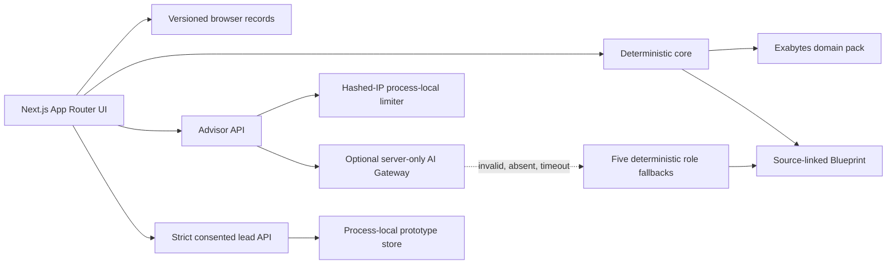
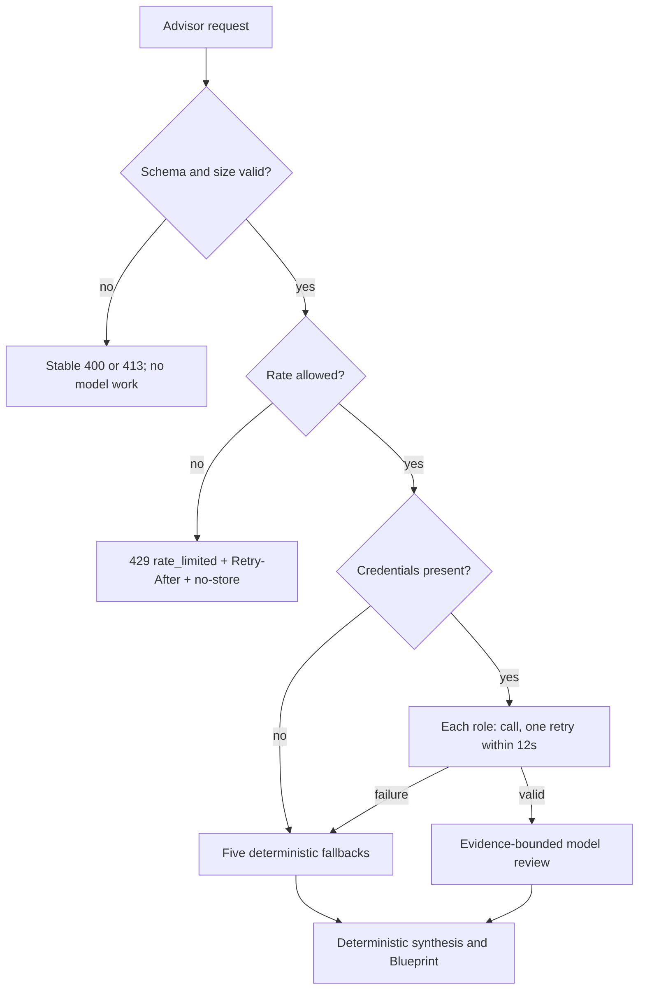

# Architecture and methodology

## Runtime data flow

## Deterministic versus AI boundary

| Deterministic code owns | Optional AI may do |
|---|---|
| input/schema validation | produce concise role-specific critique |
| Business Twin construction | point out missing evidence |
| maturity/readiness scores | propose a bounded adjustment |
| pain ranking and evidence | explain already-calculated decisions |
| capability selection/prerequisites | never add products or alter numbers |
| scenario schedule, cost, value, payback | fail independently to deterministic fallback |
| Blueprint identity/provenance | return strict structured output only |

The advisor ceiling is five frozen roles, at most two attempts per role, 900 output tokens per attempt, and 12 seconds total per role. Therefore one panel has at most ten attempts and 9,000 output tokens. The limiter stores a salted hash of a coarse request IP identifier; no raw IP, prompt, business answer, or contact value is retained in it.

## MiroFish inspiration and originality

MiroFish was studied for the responsibility chain from evidence to structured world model, actors, scenarios, report, and investigation. SME Growth Twin adapts that responsibility to a five-question SME assessment, typed Business Twin, capability-first catalogue mapping, deterministic 12-month scenarios, bounded specialist advisors, and an immutable Blueprint. It does not copy MiroFish routes, social environments, prompts, terminology, UI, storage, or code structure. The retain/adapt/replace/omit record is in `planning/MIROFISH-REFERENCE-MAP.md`.

## Failure behavior

## Data and privacy truth

Assessment/result/Blueprint records are versioned browser-local prototype records and can be removed by the scoped reset. Contact values remain in form memory and the server-side process-local lead record; the browser receives only a safe receipt. Instance lifecycle removes server records and rate-limit state. There is no production retention/deletion service, authentication, tenant isolation, encryption claim, monitoring, audit log, backup, or compliance certification.
